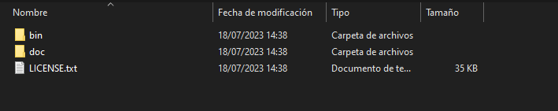
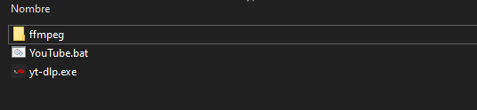

# YouTube Bat Downloader

Aplicación CMD diseñada para facilitar la descarga de videos de YouTube. 

Permite descargar fácilmente cualquier video de YouTube y Además, la aplicación permite a los usuarios seleccionar audio o video.

## Requisitos

### FFMPEG

https://github.com/BtbN/FFmpeg-Builds

##### colocar dentro de la carpeta ffmpeg, quedando la carpeta bin, en la raiz de la carpeta ffmpeg como se ve en la imagen.

### YT-DLP

https://github.com/yt-dlp/yt-dlp

##### Colocar dentro de la misma carpeta raiz en la que se encuentre el YouTube.bat como se ve en la imagen.

